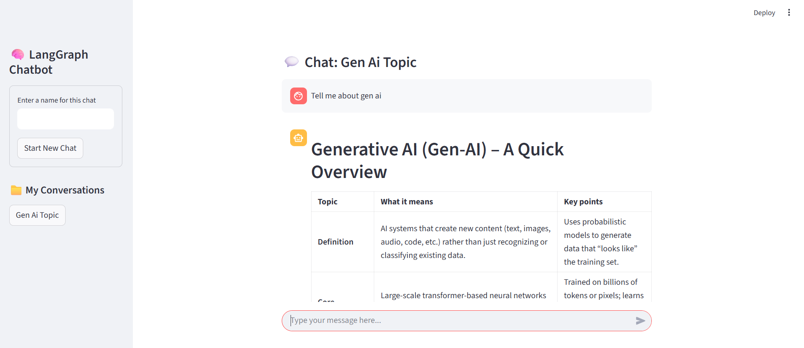

# LangGraph Chatbot

   
*Screenshot of the LangGraph Chatbot interface*

---

## Overview

LangGraph Chatbot is a Streamlit-based chat application powered by a Langchain backend. It supports multiple chat threads, message history persistence, and live assistant responses using streaming. Users can start new chat threads, switch between conversations, and interact with an AI assistant in a clean, intuitive UI.

---

## Features

- Multiple chat threads with custom names
- Persistent message history per thread
- Live AI assistant responses with streaming output
- Sidebar navigation for managing conversations
- Environment-configured Langchain backend connection

---

